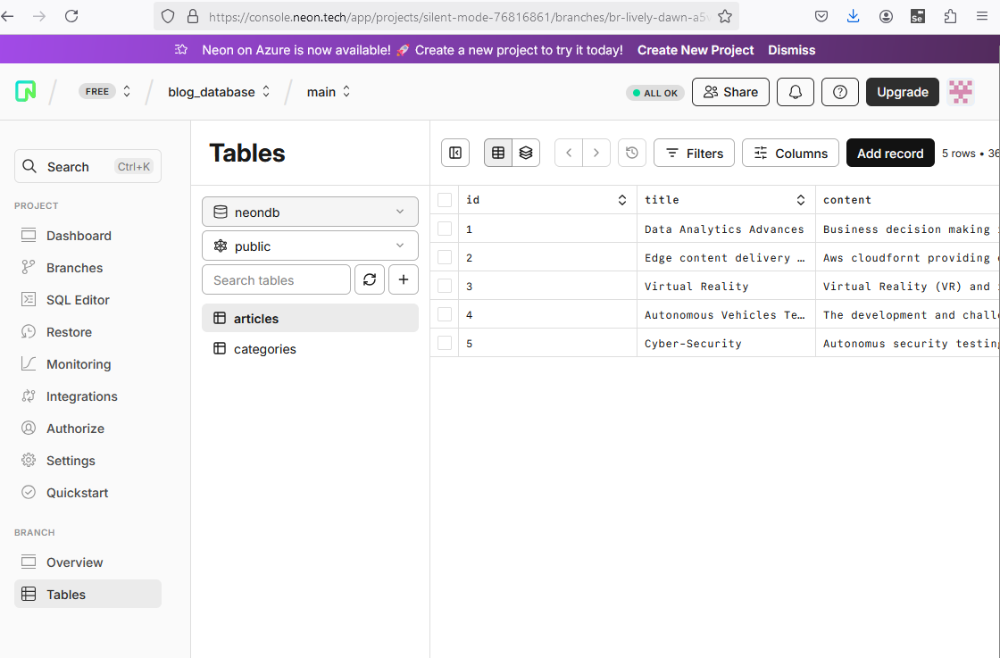

# Neon tech Integration

It is a serverless database that is on cloud. I have use URL connection to connect with database. The env file is used form dotenv library.

I have create a database name blog_database. Goto SQL Editor of neon and copy the sql code from database_query.sql and execute so that it will create table and insert data.

I have setup two tables in table database ie articles and category. The schema is also present in database_query.sql

# Steps to configure environmental variables:

1. install dotenv package

npm install dotenv

2. Use required

require("dotenv").config

// ...

use `process.env.DB_URL` in your code

3. Create .env file
4. put environment variable such as DB_URL=https:asdasd.sadad.1231
5. Now as mention in setps 2 you can use the env variable with process.env.any_variable_name in case of your code
